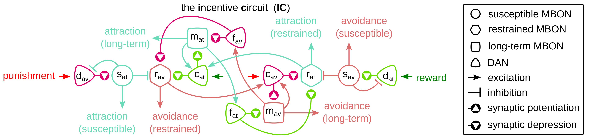

# The Incentive Circuit  [](https://github.com/InsectRobotics/IncentiveCircuit/blob/main/LICENSE)  [](https://travis-ci.com/InsectRobotics/IncentiveCircuit)


Python replication for the results from the eLife manuscript:

Gkanias, E., McCurdy, L. Y., Nitabach, M. N., & Webb, B. (2021). Incentive circuit: how flies acquire,
forget and assimilate memories. Submitted to eLife.



The "**incentive circuit**" (IC) is a model of the mushroom body in the fruit fly brain
that receives sensory input and reinforcements and modulates the motivation state of
the animal. In this model, the motivation states are limited into: *attraction* and
*avoidance*. An extension of this is the "**incentive wheel**" (IW),  which creates a
ranking of available tasks with respect to their importance given the current context.
Although IC can explain complicated dynamics of behaviours regarding olfactory
conditioning and involving the attraction and avoidance behaviours, IW is able to
trigger more complicated dynamics by driving a bigger variety of behaviours, like
feeding, sleeping, escaping or attacking.

## Environment

In order to be able to use this code, the required packages are listed below:
* [Python 3.7](https://www.python.org/downloads/release/python-370/)
* [NumPy](https://numpy.org/)
* [SciPy](https://www.scipy.org/)
* [Matplotlib](https://matplotlib.org/)
* [pandas](https://pandas.pydata.org/)
* [PyYAML](https://pypi.org/project/PyYAML/)

## Installation

In order to install the package and reproduce the results of the manuscript you need to clone the code,
navigate to the main directory of the project, install the dependencies and finally the package itself.
Here is an example code that installs the package:
```commandline
mkdir ~/projects
cd ~/projects
git clone https://github.com/InsectRobotics/IncentiveCircuit.git
cd IncentiveCircuit
pip install -r requirements.txt
pip install .
```
Note that the [pip](https://pypi.org/project/pip/) project is needed for the above installation.

## Usage

The [generate_manuscript](notebooks/generate_manuscript.ipynb) is an
[iPython notebook](https://ipython.org/notebook.html) that reproduces the results for the figures
and associates them to the manuscript. If the notebook is not rendering, you can try
[this](https://nbviewer.jupyter.org/github/InsectRobotics/IncentiveCircuit/blob/main/notebooks/generate_manuscript.ipynb)
link. Alternatively, you can find the scripts that create the plots in the manuscript in the [examples](examples)
directory and run them using: 
```commandline
python any_file_you_want.py --flag --option value
```
It is necessary to add the [src](src) directory to the PATH variable or
install the package.

You can reproduce the results by running:
```commandline
python test_learning_rule.py
python run_subcircuits.py --nb-kc 10 --sm --rm --ltm --rrm --rfm --mam
python run_incentive_circuit.py --nb-kc 10 --only-nids --structure
python run_incentive_circuit.py --nb-kc 10 --only-nids --values --weights
python run_incentive_wheel.py --nb-kc 10 --only-nids --structure
python run_incentive_wheel.py --nb-kc 10 --only-nids --values --weights
python run_data_analysis.py --stats --only-nids --verbose
python create_paths.py --nb-flies 100 --nb-time-steps 100 
python run_arena_paths.py
python run_arena_stats.py
python run_arena_pi.py
python run_olfactory_conditioning.py
python run_bennet_2021.py
```
where `--nb-kc` specifies the number of KCs (default is 10), `--odour1` specifies the
number of KCs associated to odour A and `--odour2` specifies the number of KCs
associated to odour B; `--sm`, `--rm`, `--ltm`, `--rrm`, `--rfm` and `--mam` flags
the generating of the sub-circuit results for the SM, RM, LTM, RRM, RFM and MAM
sub-circuits respectively; `--only-nids` plots only the neurons associated to the
twin-spoke model; `--structure`, `--values` and `--weights` enable plotting of the
structure, responses and KC-MBON synaptic weights of the model over time respectively;
`--stats` prints the logistics of flies in the data-set; and `--verbose` allows
printing in the console during the processing of the files.

## Report an issue

If you have any issues installing or using the package, you can report it
[here](https://github.com/InsectRobotics/IncentiveCircuit/issues).

## Author

The code is written by [Evripidis Gkanias](https://evgkanias.github.io/).

## Copyright

Copyright &copy; 2021, Insect robotics Group, Institute of Perception,
Action and Behaviour, School of Informatics, the University of Edinburgh.
