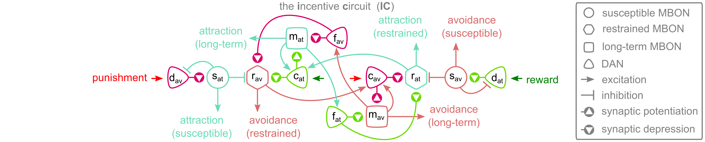

# The Incentive Circuit  [](https://github.com/InsectRobotics/IncentiveCircuit/blob/main/LICENSE)  <a href="https://app.travis-ci.com/InsectRobotics/IncentiveCircuit" target="_blank"></a>


Python replication for the results from the eLife manuscript:


Gkanias, E., McCurdy, L. Y., Nitabach, M. N. & Webb, B. An incentive circuit for memory
dynamics in the mushroom body of *Drosophila melanogaster*. Elife 11, e75611 (2022).

DOI: [10.7554/eLife.75611](https://doi.org/10.7554/eLife.75611)



The "*incentive circuit*" (IC) is a model of the mushroom body in the fruit fly brain
that receives sensory input and reinforcements and modulates the motivation state of
the animal. In this model, the motivation states are limited into: *attraction* and
*avoidance*.
This repository allows reconstructing the results presented in the original article.
Below, you can find information of how to set up the environment and run the examples
that generate the appropriate figures.

## Environment

In order to be able to use this code, the required packages are listed below:
* [Python 3.7](https://www.python.org/downloads/release/python-370/)
* [NumPy](https://numpy.org/)
* [SciPy](https://www.scipy.org/)
* [Matplotlib](https://matplotlib.org/)
* [pandas](https://pandas.pydata.org/)
* [PyYAML](https://pypi.org/project/PyYAML/)

## Installation

In order to install the package and reproduce the results of the manuscript you need to clone the code,
navigate to the main directory of the project, install the dependencies and finally the package itself.
Here is an example code that installs the package:
```commandline
mkdir ~/projects
cd ~/projects
git clone https://github.com/InsectRobotics/IncentiveCircuit.git
cd IncentiveCircuit
pip install -r requirements.txt
pip install .
```
Note that the [pip](https://pypi.org/project/pip/) project is needed for the above installation.

## Usage

The [generate_manuscript](notebooks/generate_manuscript.ipynb) is an
[iPython notebook](https://ipython.org/notebook.html) that reproduces the results for the figures
and associates them to the manuscript. If the notebook is not rendering, you can try
[this](https://nbviewer.jupyter.org/github/InsectRobotics/IncentiveCircuit/blob/main/notebooks/generate_manuscript.ipynb)
link. Alternatively, you can find the scripts that create the plots in the manuscript in the [examples](examples)
directory and run them using: 
```commandline
python any_file_you_want.py --flag --option value
```
It is necessary to add the [src](src) directory to the PATH variable or
install the package.

You can reproduce the results by running:
```commandline
python run_bennett_2021.py
python plot_data.py --stats --only-nids --verbose
python plot_model.py --only-nids --values --weights --verbose
python create_arena_paths.py --nb-flies 100 --nb-time-steps 100 -R 10 --dir "data" --verbose
python plot_arena_fishbone.py -R 10 -V "A and B" --dir "data" --verbose
python plot_arena_fishbone_weights.py -R 10 -V "A and B" --dir "data" --verbose
python plot_arena_paths.py -R 10 --dir "data" --verbose
python run_unpaired_a.py
python run_handler_2019.py
```
where `--only-nids` plots only the neurons associated to the incentive circuit;
`--values` and `--weights` enable plotting of the responses and KC-MBON synaptic weights of the model over time respectively;
`--stats` prints the logistics of flies in the data-set;
`--nb-flies` specifies how many flies to simulate;
`--nb-time-steps` the number of time-steps per repeat;
`-R` the number of repeats for each experiment;
`--dir` the directory where to store or load the data from;
`-V` specifies which subset of flies to plot, depending on the odours they have visited; and
`--verbose` allows printing in the console during the processing of the files.

## Report an issue

If you have any issues installing or using the package, you can report it
[here](https://github.com/InsectRobotics/IncentiveCircuit/issues).

## Author

The code is written by [Evripidis Gkanias](https://evgkanias.github.io/).

## Copyright

Copyright &copy; 2022, Evripidis Gkanias; Institute of Perception,
Action and Behaviour; School of Informatics; the University of Edinburgh.
